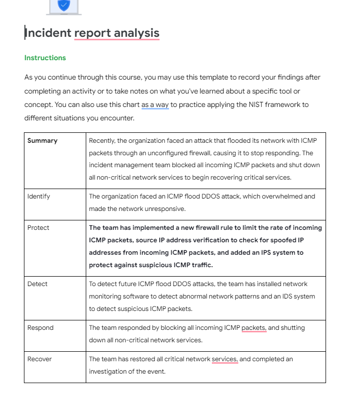

<h1>Analyzing network structure and security</h1>


<h2>Description</h2>
In this project, an incident report is created after analyzing a network incident.
<br />


<h2>Languages and Utilities Used</h2>

- <b>Google docs</b> 
- <b>Coursera</b> 

<h2>Environments Used </h2>

- <b>Windows 10</b> 

<h2>Network incident report walk-through:</h2>

<p align="center">
Analyzing network structure and security incident report: <br/>

<br />
<br />


<!--
 ```diff
- text in red
+ text in green
! text in orange
# text in gray
@@ text in purple (and bold)@@
```
--!>
